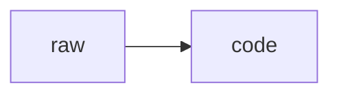
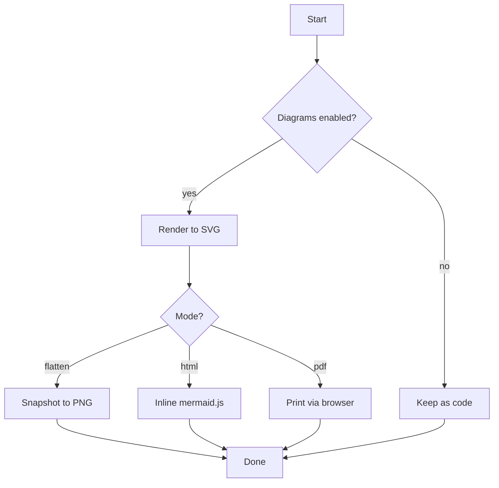
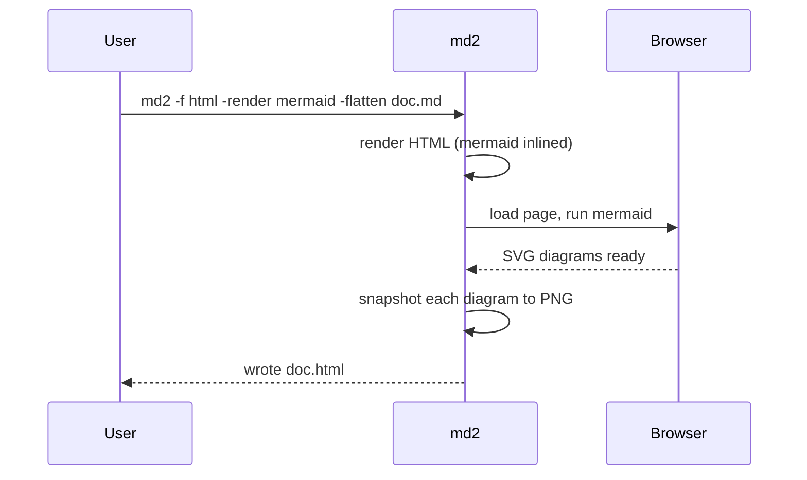
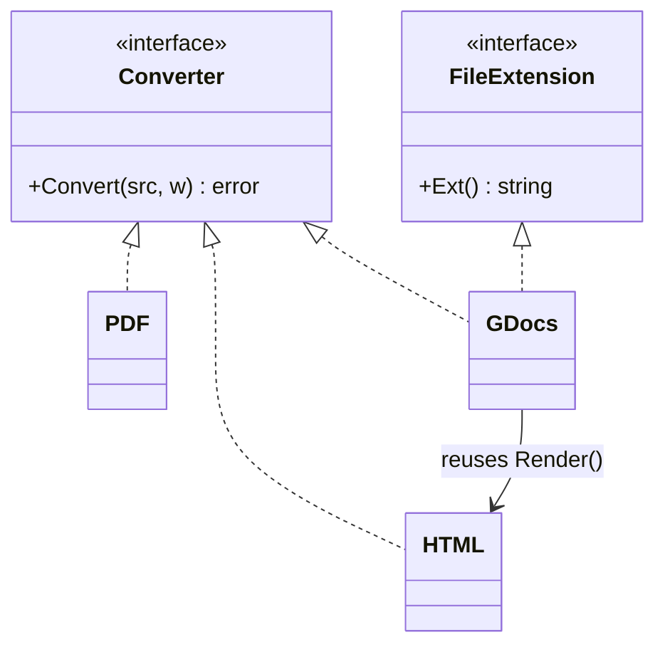
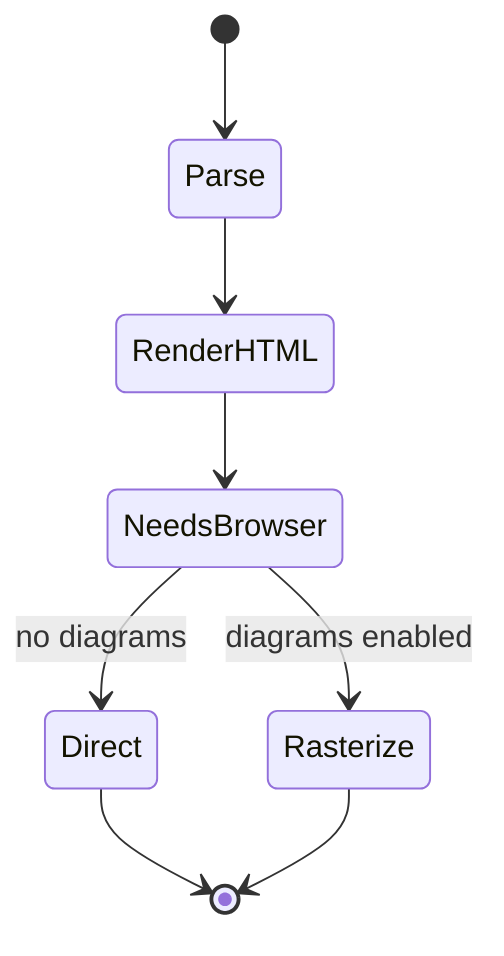
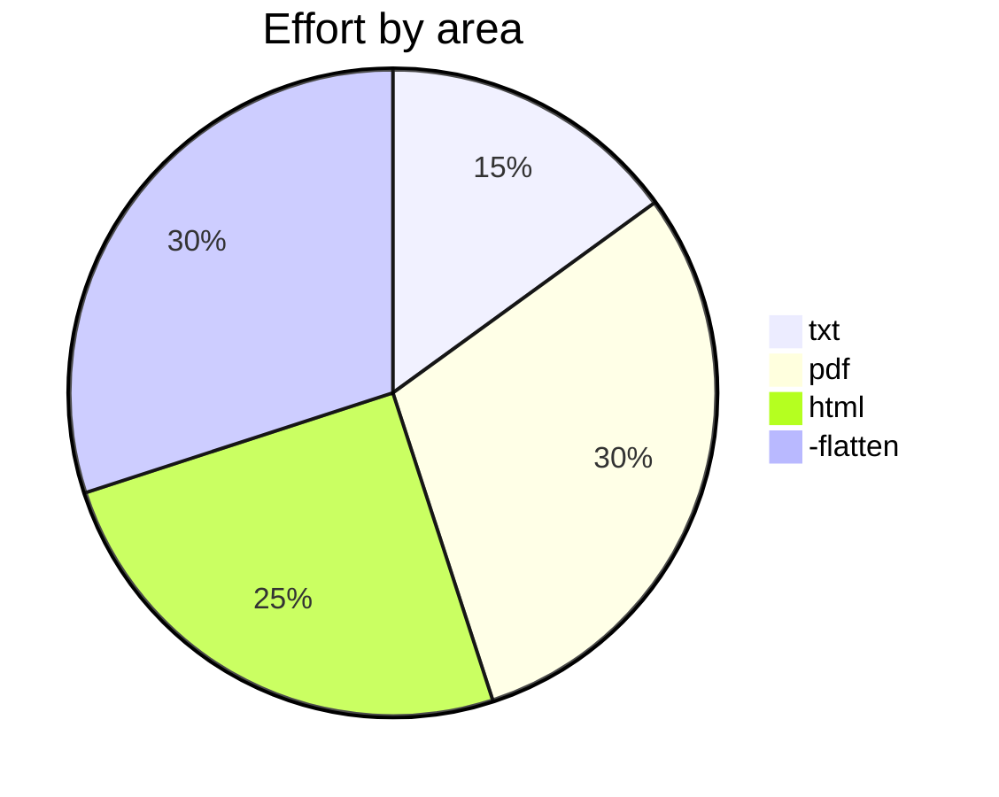

# md2 Kitchen-Sink Document

A deliberately dense markdown file for exercising every renderer
(`pdf`, `html`, `txt`), the `-render mermaid` path, and `-flatten`.

> Run it:
> ```sh
> md2 -f html -render mermaid testdata/complex.md            # interactive diagrams
> md2 -f html -render mermaid -flatten testdata/complex.md   # diagrams as images
> md2 -f pdf,html,txt -render all testdata/complex.md
> ```

---

## 1. Table of Contents (in-document anchor links)

- [Inline formatting](#2-inline-formatting)
- [Lists](#3-lists)
- [Tables](#4-tables)
- [Code blocks](#5-code-blocks)
- [Blockquotes](#6-blockquotes)
- [Diagrams](#7-diagrams-mermaid)
- [Edge cases](#8-edge-cases)

---

## 2. Inline formatting

Plain text with **bold**, *italic*, ***bold italic***, ~~strikethrough~~,
`inline code`, and a mix: **bold with `code` inside** and *italic with
[a link](https://example.com) inside*.

Links: [labelled](https://go.dev), bare autolink <https://github.com/rapatao/md2>,
a [relative link](./README.md), and an [anchor back to the top](#md2-kitchen-sink-document).

A local inline image, referenced by a relative path: .
The `html` format embeds it as a data URI so it survives a Google Docs import;
an inline data URI works too: .

Hard break below (two trailing spaces):
line one  
line two.

Escapes: \*not italic\*, \`not code\`, and a literal backslash \\.

---

## 3. Lists

### 3.1 Unordered, nested

- Top level one
  - Second level
    - Third level with `code`
    - Third level with **bold**
  - Back to second
- Top level two

### 3.2 Ordered, nested, custom start

3. Starts at three
4. Four
   1. Nested a
   2. Nested b
      - mixed unordered child
5. Five

### 3.3 Task list (GFM)

- [x] Implement html
- [x] Implement -flatten (diagrams as images)
- [ ] Implement docx
- [ ] World domination

### 3.4 List item with multiple blocks

1. First item with a paragraph.

   A second paragraph inside the same item.

   ```python
   def inside_list():
       return "code block inside a list item"
   ```

2. Second item.

---

## 4. Tables

### 4.1 Alignment

| Left | Center | Right |
| :--- | :----: | ----: |
| a    | b      | c     |
| longer cell | mid | 1234 |
| `code` | **bold** | *italic* |

### 4.2 Table with inline markup and a link

| Feature        | Status      | Notes                                  |
| -------------- | ----------- | -------------------------------------- |
| PDF            | ✅ done      | pure-Go, [browser fallback](#5-code-blocks) |
| HTML           | ✅ done      | inlines mermaid when enabled           |
| Google Docs    | ✅ done      | diagrams flattened to PNG              |
| DOCX           | ⏳ planned   | native round-trip                      |

---

## 5. Code blocks

Indented code block:

    $ md2 -f pdf input.md
    wrote input.pdf

Fenced, no language:

```
no language tag here
just preformatted text
```

Fenced Go:

```go
package main

import "fmt"

func main() {
    // unicode in a comment: café, naïve, 北京
    fmt.Println("hello, 世界")
}
```

Fenced JSON:

```json
{
  "format": "html",
  "render": ["mermaid"],
  "flatten": true,
  "nested": { "ok": true, "list": [1, 2, 3] }
}
```

A code block that *looks* like a diagram but is NOT rendered unless `-render`
enables it — without the flag it stays as code:



---

## 6. Blockquotes

> Single-level quote with **bold** and `code`.

> Outer quote.
>
> > Nested quote.
> >
> > > Triple-nested, with a list:
> > >
> > > - item one
> > > - item two

> A quote containing a code block:
>
> ```sh
> echo "quoted code"
> ```

---

## 7. Diagrams (mermaid)

These render only with `-render mermaid` (or `-render all`). In `html` they
render client-side via mermaid.js, or as an inline PNG with `-flatten`; in `pdf`
they force the browser engine; in `txt` they stay as source.

### 7.1 Flowchart



### 7.2 Sequence



### 7.3 Class diagram



### 7.4 State diagram



### 7.5 Pie chart



---

## 8. Edge cases

### 8.1 Unicode & emoji (PDF strips non-BMP)

ASCII, Latin-1 (é ñ ü), CJK (日本語 中文 한국어), math (∑ ∫ ≠ ≤ ∞),
and emoji (🚀 🔥 ✅ — these are dropped in the pure-Go PDF path).

### 8.2 Raw HTML

<div align="center">
  <strong>Centered raw-HTML block</strong> — kept in HTML, stripped in text.
</div>

Inline raw HTML: this is <sub>subscript</sub> and <sup>superscript</sup>.

### 8.3 Horizontal rules

Above.

***

Between.

___

Below.

### 8.4 Long line (wrapping)

Lorem ipsum dolor sit amet, consectetur adipiscing elit, sed do eiusmod tempor incididunt ut labore et dolore magna aliqua, ut enim ad minim veniam, quis nostrud exercitation ullamco laboris nisi ut aliquip ex ea commodo consequat.

### 8.5 Empty-ish and special characters

Ampersand & angle < brackets > and "quotes" and 'apostrophes' and a
percent-encoded URL: <https://example.com/path?q=a%20b&x=1>.

---

*End of document.*
